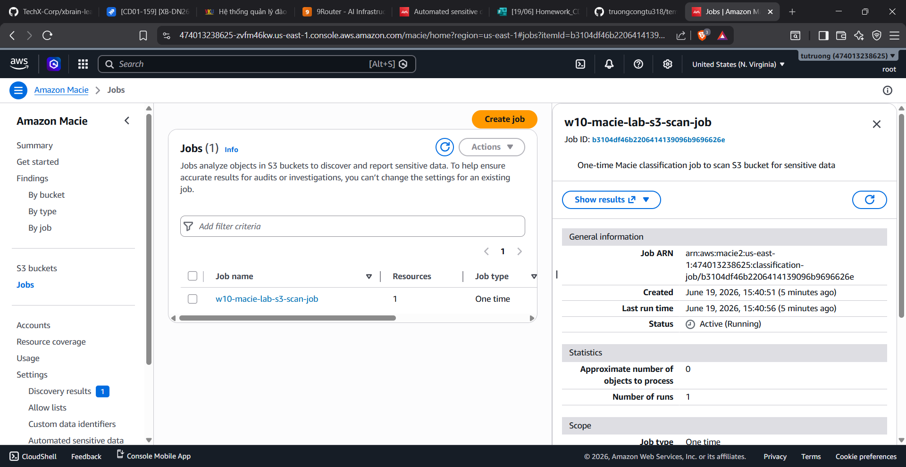
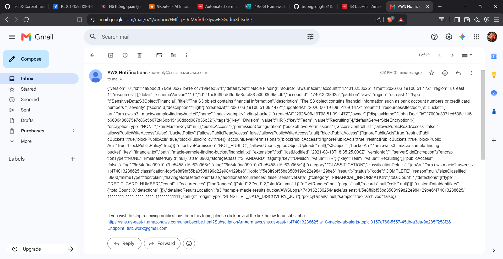

# Lab W10: Detect sensitive data in Amazon S3 buckets and send notifications using Amazon Macie

## 1. Mô tả kiến trúc
Hệ thống sử dụng Terraform để triển khai tự động các thành phần:
* **Amazon S3**: Lưu trữ các tệp tin kiểm thử (`clean.txt`, `sensitive.txt`).
* **Amazon Macie**: Quét phát hiện các dữ liệu nhạy cảm (PII, Financial, Credentials).
* **Amazon EventBridge**: Bắt sự kiện phát hiện cảnh báo từ Macie.
* **Amazon SNS**: Gửi email cảnh báo trực tiếp đến người quản trị.

## 2. Minh chứng hoàn thành Lab

### Kết quả phát hiện dữ liệu nhạy cảm trong Amazon Macie

### Kết quả cảnh báo gửi về email qua Amazon SNS

*Toàn bộ tài nguyên AWS tạo ra trong bài lab này đã được dọn dẹp (destroyed) thành công để tránh phát sinh chi phí.*
