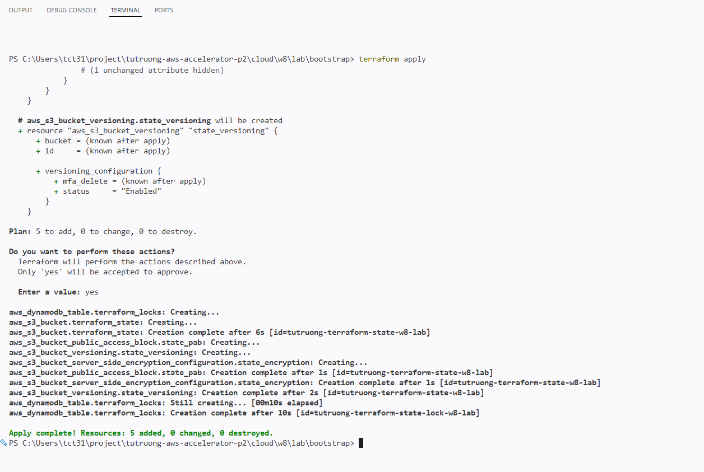
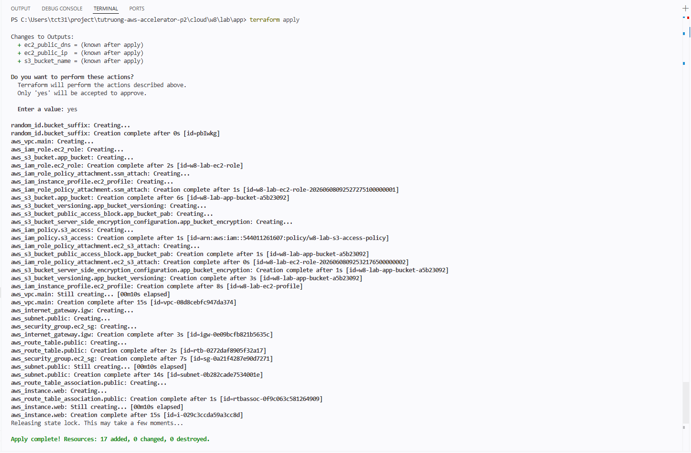
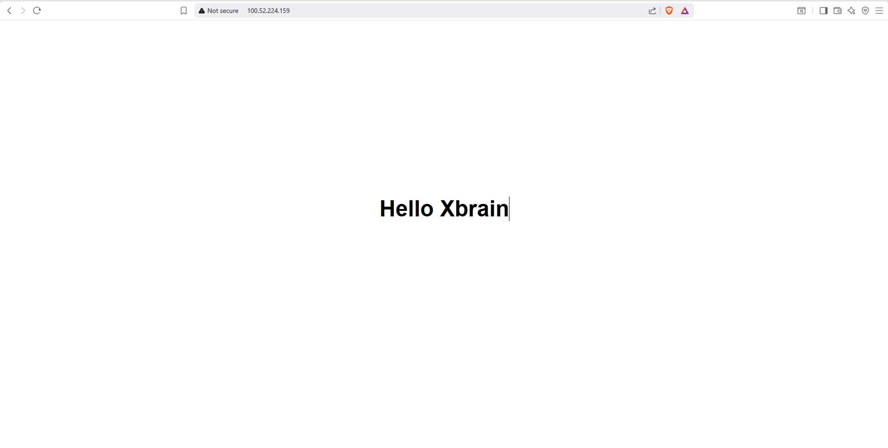
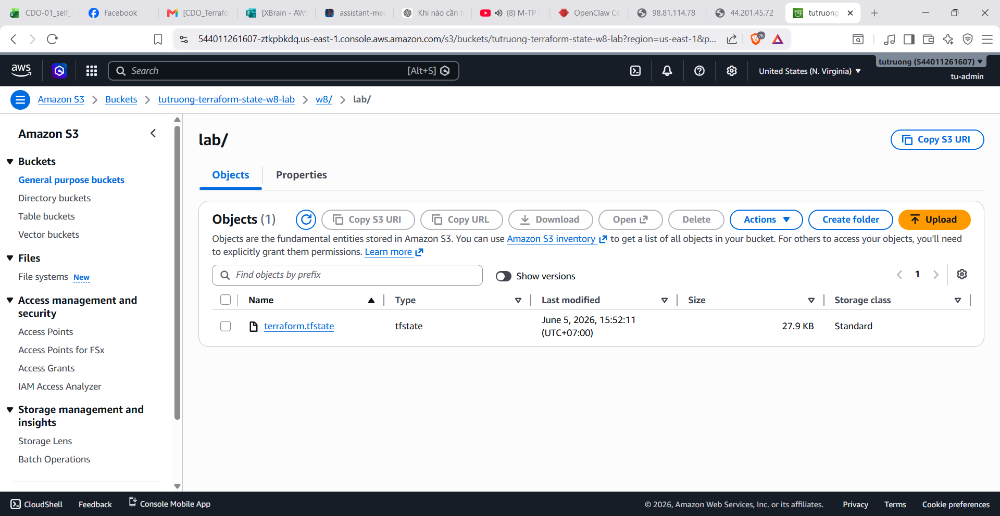

# Báo cáo Thực hành: Triển khai AWS Infrastructure bằng Terraform

## Thông tin dự án
- **Bài toán:** Cấp phát VPC với Public Subnet, Internet Gateway, Route Tables, cấu hình EC2 instance (cấp quyền bằng IAM Role) để truy cập S3 Bucket.
- **Công cụ:** Terraform, AWS (EC2, VPC, S3, IAM, SSM).

---

## 1. Yêu cầu đã hoàn thành (Achieved Requirements)
- [x] Tạo VPC custom, Internet Gateway, Public Subnet, Route Table.
- [x] Khởi tạo Web Server (Apache httpd) tự động trên EC2 thông qua `user_data` hiển thị trang web "Hello Xbrain".
- [x] Cấu hình Output trả về Public IP/DNS của EC2 và tên S3 bucket.
- [x] Tạo S3 Bucket (`tutruong-terraform-state-w8-lab`) và DynamoDB Table (`tutruong-terraform-state-lock-w8-lab`) làm Remote Backend để lưu trữ state và locking.
- [x] Đã thực hiện migrate thành công local state lên S3 và kích hoạt cơ chế khóa trạng thái (State Locking) bằng DynamoDB.
- [x] Cấp phát 1 Amazon Linux EC2 instance.
- [x] Cấp phát 1 S3 bucket cho ứng dụng.
- [x] Gắn IAM Role cho EC2 để có quyền tương tác (Read/Write) với S3 bucket.
- [x] Đóng toàn bộ Port SSH (22) mở ra internet.
- [x] Tích hợp AWS Systems Manager (SSM) qua policy `AmazonSSMManagedInstanceCore` để kết nối vào EC2 thay cho key pair.
- [x] Ép EC2 dùng IMDSv2 chống lỗi SSRF (`http_tokens = "required"`).
- [x] Bật Block Public Access, Versioning, SSE-S3 encryption cho S3 Bucket ứng dụng.
- [x] Bật mã hoá Root block volume trên EC2.

---

## 2. Cấu trúc Source Code
Dự án được phân tách thành 2 thư mục riêng biệt theo Best Practice:

- `bootstrap/`: Tạo hạ tầng quản lý State (S3 & DynamoDB). Lưu state tại local.
- `app/`: Tạo VPC, EC2, S3 bucket cho ứng dụng và sử dụng cấu hình Remote Backend trỏ vào hạ tầng vừa dựng bởi thư mục bootstrap.

### Chi tiết các file trong thư mục `app/`:
- `providers.tf`: Định nghĩa AWS provider và **cấu hình S3 Remote Backend**.
- `variables.tf`: Biến môi trường (region, CIDR blocks).
- `main.tf`: Chứa Networking (VPC, Subnet, IGW, Route Table).
- `sg.tf`: Security Group (chỉ mở HTTP, khóa SSH).
- `ec2.tf`: Định nghĩa máy ảo EC2 (`t3.small`) kết hợp `user_data` cài Apache Web Server.
- `outputs.tf`: Lưu cấu hình in ra Public DNS, Public IP và Tên S3 Bucket sau khi hoàn tất cấp phát.
- `s3.tf`: Định nghĩa S3 bucket ứng dụng và các policy bảo vệ.
- `iam.tf`: Định nghĩa IAM Role, Policy S3 Access, Policy SSM Access.

---

## 3. Minh chứng thực hành (Submission Proofs)

*Dưới đây là các minh chứng hạ tầng đã được cấp phát thành công thông qua Terraform:*

### 3.1. Chạy lệnh Terraform Apply (Bootstrap Backend & App)

*(Log kết quả quá trình cấp phát Remote Backend bằng Terraform)*

*(Log kết quả quá trình cấp phát Application - VPC, EC2, S3)*

### 3.2. Truy cập Trang Web của EC2 (Apache Web Server)

*(Truy cập bằng Public IP của EC2 thông qua Trình duyệt hiển thị trang "Hello Xbrain")*

### 3.3. Trạng thái Remote Backend (S3 State & DynamoDB Lock)

*(Minh chứng State đã được đẩy lên mây: S3 bucket chứa file `w8/lab/terraform.tfstate` và DynamoDB Table cấu hình Lock trên AWS Console)*
